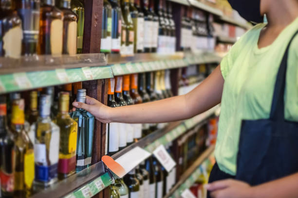
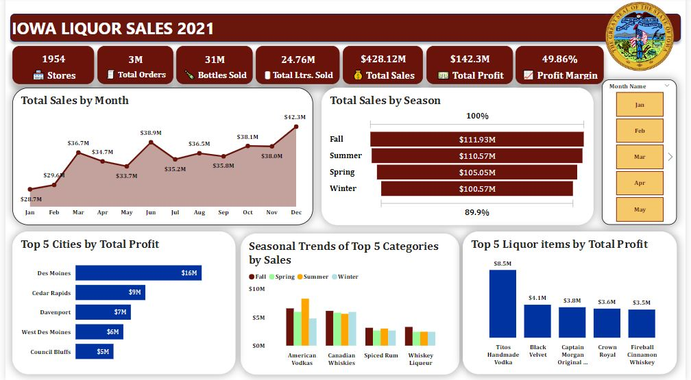

# IOWA LIQUOR SALES (2021) ANALYSIS

# Overview
>The Iowa liquor sales dataset contains the spirits purchase information of Iowa Class “E” liquor licenses by-product for January 2021 to January 2022. 

## Objective
The main objective of this analysis is to provide insights from the Iowa Liquor Sales (2021) dataset to understand sales performance, seasonal treends and consumer preferences.
>The specific objectives are:
- to identify top selling and low sales liquor items.
- to identify counties and cities with highest sales
- to analyze seasonal sales patterns.

## Dataset
**Data Source:** The dataset used for this analysis was provided by the Iowa Department of Revenue, Alcoholic Beverage. (https://data.iowa.gov/Sales-Distribution/Iowa-Liquor-Sales/m3tr-qhgy)

The original dataset consists of 24 columns and 2,805,307 rows. Metadata below:
1.	invoice_and_item_number: provides a unique identifier for the individual liquor products included in the store order.
2.	date: date of order. 
3.	store_number: unique number assigned to the store who ordered the liquor.
4.	store_name: name of store who ordered the liquor.
5.	address: address of store who ordered the liquor.
6.	city: city where the store who ordered the liquor is located.
7.	zip_code: zip code where the store who ordered the liquor is located 
8.	store_location: location of store who ordered the liquor. The address, city, state and zip code are geocoded to provide geographic coordinates.
9.	store_name: name of store who ordered the liquor.
10.	county: county where the store who ordered the liquor is located.
11.	category: category code associated with the liquor ordered.
12.	category_name: category of the liquor ordered.
13.	vendor_number: the vendor number of the company for the brand of liquor ordered.
14.	 vendor_name: the vendor name of the company for the brand of liquor ordered.
15.	item_number: item number for the individual liquor product ordered.
16.	item_description: description of the individual liquor product ordered.
17.	pack: the number of bottles in a case for the liquor ordered.
18.	bottle_volume_ml: volume of each liquor bottle ordered in milliliters.
19.	state_bottle_cost: the amount that alcoholic beverages division paid for each bottle of liquor ordered.
20.	state_bottle_retail: the amount the store paid for each bottle of liquor ordered.
21.	bottles_sold: the number of bottles of liquor ordered by the store.
22.	sale_dollars: total cost of liquor order.
23.	volume_sold_liters: total volume of liquor ordered in liters.
24.	volume_sold_gallons: total volume of liquor ordered in gallons. 

## Methodology
1. Data Transformation: TThe dataset was duplicated and a copy was loaded into Power BI for preprocessing and analysis.
2. Data Visualization: Different visualizations such as line charts, bar charts, column charts, etc were employed to visualize trends and derive insights.
3. Exploratory Analysis: It was used to identify general sales trends in the data.

## Data Analytics Tool
**Power Bi**

## Data Visualization

## Key Insights
1.	There were 1954 stores.
2.	There were 57 liquor categories.
3.	There were 3 million total orders.
4.	31 million bottles were sold.
5.	A total of 24.76 million liters of liquor were sold.
6.	A total sale of $428.12 million was made.
7.	A total profit of $142.30 million with a profit margin of 49.86%.

## Conclusion
This analysis has revealed the sales patterns as well as the seasonal trends of liquor sales in Iowa for the year 2021. Consumer preferences and behavior greatly impacted sales volume throughout the year. Sales patterns changed with the four seasons, most sales were made in fall and sales were low in winter. This analysis also highlights key insights into the profitability of liquor sales in different counties, cities, stores, vendors, categories and liquor items.

## Recommendation
Based on the findings of this analysis, the following recommendations are proposed:
1.	Vendors and store owners should leverage on insights from this analysis and tailor their sales strategies and product offerings based on the identified patterns.  
2.	 High-performing regions can be targeted by vendors and aspiring store owners as these regions have shown high profitability. 

